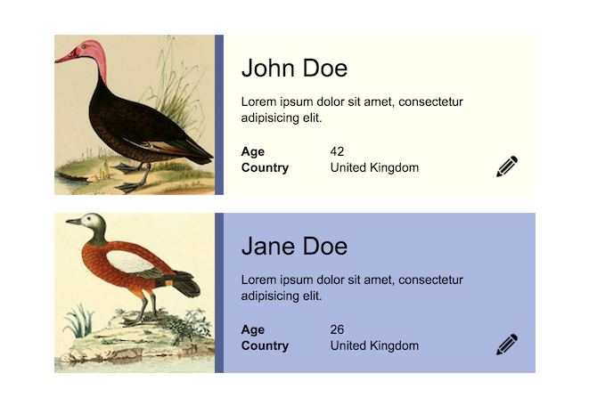

# Exam: HTML & CSS

### Getting Started
 - Fork this repository under your own account
 - Commit your progress frequently and with descriptive commit messages
 - All your answers and solutions should go in this repository

### What can I use?
 - You can use any resource online, but **please work individually**
 - Instead of copy-pasting your answers and solutions, write them in your own words.


# Tasks

## 1. Build a design (~90 minutes) [10 points]
Build the following profile cards according to the design provided.   
Follow the design as closely as possible.   
Commit an HTML and a CSS file to this repository.


### Assets
John Duck | Jane Duck | Pencil icon
--------- | --------- | -----------
 |  |    

### Other data
  - Name font size: 28 pixels
  - Text size: 14 pixels
  - Font family: Arial, sans-serif

### Acceptance criteria
The task is accepted if:
  - The result follows design [2p]
  - The code follows style guide [1p]
  - The CSS & HTML are valid [1p]
  - The HTML considers semantic responsibilities [2p]
  - The code avoids code duplication [2p]
  - The CSS has meaningful and short selectors [2p]

Extra points for if:
  - the result is centered on the page [2p]


## 2. Understand code (~15 minutes) [2 points]
Read the following code snippet:   
What is the distance between the top-left corner of the document body and the yellow box?   
Give a detailed explanation below!   
Add your answer to this readme file, commit your changes to this repository.
```HTML
<!DOCTYPE html>
<html>
  <head>
    <style>
      body {
        padding: 0px;
        margin: 0px;
      }
      .foo {
        top: 20px;
        left: 20px;
        width: 100px;
        height: 100px;
        position: absolute;
        background: blue;
      }
      .bar {
        top: 20px;
        left: 20px;
        width: 30px;
        height: 30px;
        position: absolute;
        background: yellow;
      }
    </style>
  </head>
  <body>
    <div class="foo">
      <div class="bar"></div>
    </div>
  </body>
</html>
```
#### Your answer: [2p]
Since there is no other relative option , the box positioning will take the body itself as relative.From the top-left corner the distance supposed to be which the code positioning on the box (means if we say top:20px; and left:20px; then its going to be that far awaz from the top left pixel.).

## 3. Explain concepts (~15 minutes) [4 points]
Add your answer to this readme file, commit your changes to this repository.


### Explain the difference between `display: block` and `display: inline` in CSS! What is `display: inline-block`?
#### Your answer: [2p]
'display:block;' is a display mode which displays any element as a block. Which is important to know about it , that no other element could get next to it generally , since block level elements using 100% width. You can use display inline , if you want to put any content next to your block level element.With 'display:inline-block;' you can even put a block level element next to your block level element.

### What is the difference between a `<section>` and an `<article>` element? Name one good example of using an `<article>`.
#### Your answer: [2p]
Article is a self-contained composition. It is mostly good to hold articles, like a blog , or an actual article.
Section on the other hand could mean any separated seciton on the site or even a part of it.
